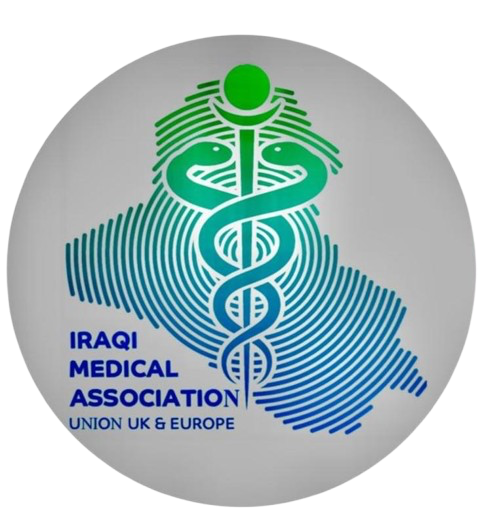

# IMA UK • Poster Maker & Carousel Maker

A mobile-first, high-performance web studio for creating branded social media posters and multi-slide carousels for the **Iraqi Medical Association UK & Europe (IMA UK)**.

## Features

- **Mode Selection**:
  - **Poster Maker**: Single-slide high-impact graphic (1:1 Square & 4:5 Portrait).
  - **Carousel Maker**: Multi-slide sequence with add, duplicate, delete, and auto-numbered slide indicators (`01 / 05`).
- **Brand Typography**:
  - Google Font `Sora` for English and Arabic (paired with geometric Arabic fallback `IBM Plex Sans Arabic`).
  - One-click **EN / AR** language toggle with full native RTL (Right-to-Left) typography.
- **Brand Identity**:
  - Constant IMA UK colors: Deep Medical Navy (`#00336a`), Clinical Emerald Teal (`#069e85`), Midnight Navy (`#021220`).
  - Embedded official IMA UK crest and logo variants (full color, emblem, custom placement).
- **Inline Text Editing**:
  - Click directly on any text element on the slide to edit instantly.
- **Background & Media**:
  - Upload any photo with drag-and-drop.
  - Overlay darkness slider (0% to 90%) for text readability.
  - Automatic fallback to signature brand gradients & solid colors when no photo is loaded.
- **High-Resolution Export**:
  - Client-side 1080px crisp PNG generation with `html2canvas`.
  - Batch export all carousel slides as a bundled ZIP file using `JSZip`.
- **Zero Build Step**:
  - Pure vanilla JavaScript, CSS, and HTML with offline-ready vendor scripts. Works instantly on mobile browsers (iOS Safari, Android Chrome) and desktops.

## Live Deployment

- Hosted on GitHub Pages: `https://ph0mj.github.io/poster-maker/`
- Carousel Direct Link: `https://ph0mj.github.io/poster-maker/?mode=carousel`

---
© Iraqi Medical Association UK & Europe. All rights reserved.
